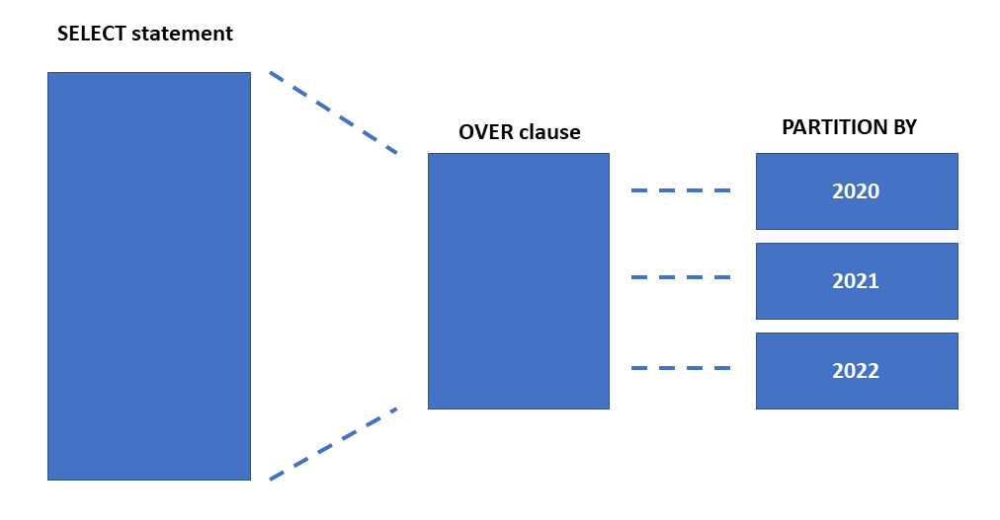

# Write queries that use window functions

Allow you to define a subset of rows and apply functions against those rows.

Can be used in place of constructs such as self joins or temporary tables.

Learn:
- Describe window functions
- Use `OVER` clause
- Use `RANK`, `AGGREGATE`, `OFFSET` functions

## Describe window functions:

Require a set of rows, known as a window, to apply the window function on - `OVER` is used to define that window.

Enable solutions for row numbers or running totals, as well as efficeint ways to compare values without a join.

Provide unique functionality that is hard to replciate:
- order rows without affecting sort order of output
- apply separate window functions to a divided result set
- subdividing a partition by defining upper and lower boundaries of window frame

---

## Use `OVER` clause:

Defines the window (rows) that the function is applied to - all, subset, specific order?

`OVER` clause takes the following arguments:
- Which group of rows? - `PARTITION BY`: splits rows into groups.
- In which order? - `ORDER BY`: establishes an order inside each partition.
- Which rows around the current row? - `ROWS / RANGE`: defines the window frame.

> Using `ORDER BY` without explicitly defining a frame, behaviour defaults to the equivalent of writing `RANGE BETWEEN UNBOUNDED PRECEDING AND CURRENT ROW` meaning the range from the start of the first row in the partition to the current row.

```sql
SUM(sales) OVER (
    PARTITION BY department
    ORDER BY sale_date
)
```

Is equivalent to:

```sql
SUM(sales) OVER (
    PARTITION BY department
    ORDER BY sale_date
    RANGE BETWEEN UNBOUNDED PRECEDING AND CURRENT ROW
)
```

> If `ORDER BY` is not passed as an argument, the entire partition is used as a frame.

> If `OVER` clause is not used the function will be applied to the entuire result set as a normal function rather than window function, e.g., SUM() without OVER becomes a normal aggregate function rather than aggregate window function.



### `PARTITION BY`:

Divides results into partitions prior to applying window function - uses one of the columns made available in the `FROM` clause, e.g., calculate average sales seperately for each department:

```sql
SELECT
    employee_id,
    department,
    salary,
    AVG(salary) OVER (
        PARTITION BY department
    ) AS department_avg_salary
FROM employees;
```

### `ORDER BY`:

Defines logical order in each partition. Default is ASC but good practice to specify. In combination with default logic, running total of dates from start to current row, starting at earliest date:

```sql
SELECT
    sale_date,
    sales,
    SUM(sales) OVER (
        ORDER BY sale_date
    ) AS running_total
FROM sales;
```

E.g., `RANK` requires ordered partitions to return rank position of each row.

> NULL treated as lowest value - appearing first in ASC ordering.

### `ROWS` or `RANGE`:

Define the start and end boundary around the rows - requires an `ORDER BY` clause within the `OVER` clause.

`ROWS` limit rows in partition by specifying fixed number of rows preceeding or following current row. Eplicit running total of rows between start date and current:

```sql
SELECT
    sale_date,
    sales,
    SUM(sales) OVER (
        ORDER BY sale_date
        ROWS BETWEEN UNBOUNDED PRECEDING
                 AND CURRENT ROW
    ) AS running_total
FROM sales;
```

`RANGE` limits rows in partition by specifying range of values with respect to current row.

```sql
SELECT
    sale_date,
    sales,
    SUM(sales) OVER (
        ORDER BY sale_date
        RANGE BETWEEN UNBOUNDED PRECEDING
                  AND CURRENT ROW
    ) AS total
FROM sales;
```

> Distinction can be seen from these two outputs where top is ROWS and bottom is RANGE:

> ROWS:
Jan 1   10    10
Jan 2   20    30
Jan 2   30    60
Jan 3   40   100

> RANGE
Jan 1   10    10
Jan 2   20    60
Jan 2   30    60
Jan 3   40   100

> ROWS is based on row position while range is based on order by values / peer groups - equivalent values.

Common frame terms include:
- `UNBOUNDED PRECEDING`: beginning of the partition
- `1 PRECEDING`: row before current row
- `CURRENT ROW`: current row
- `1 FOLLOWING`: one row after current
- `UNBOUNDED FOLLOWING`: end of partition

### `CURRENT ROW`:

Can be used to specify both a starting and or end point when used with `ROWS` or the current value in range.

### `BETWEEN AND`:

Used with `ROWS` or `RANGE` to specify start and end boundayr points.

## Use `RANK`, `AGGREGATE`, and `OFFSET` functions

Window operations use apply functions on a set of rows defined byt he `OVER` clause and its arguments.

Window functions can be categorised as:
- Aggregate functions (e.g., SUM, AVG, COUNT) - return a scalar value.
- Ranking functions (e.g., RANK, ROW_NUMBER, NTILE) - reuqire a sort nad return rank of each row in partition.
- Analytic functions (e.g., CUME_DIST, PERCENTILE_CONT, PERCENTIL_DIST, LAG, LEAD, FIRST_VALUE, LAST_VALUE) - calculate the distribution of partitions or return value of another row relative to current row.

### Aggregate functions:

Return totals, aveerages or counts - return singel value - apart from COUNT they do not aggregate NULL values.

### Ranking functions:

Assign row ranks based on ordered position defined by ORDER BY.

### Analytic functions:

Calculates value based on group of rows - used for moving averages, running totals, top N results, and returning values relative to current row.

Functions inlclude:
- CUME_DIST
- PERCENT_RANK
- PERCENTILE_CONT
- PERCENTILE_DISC
- LAG
- LEAD
- FIRST_VALUE
- LAST_VALUE

LAG, LEAD, FIRST_VALUE, and LAST_VALUE return value from another row relative to current row.
- LAD and LEAD operate on an offsett to current row and require ORDER BY clause.

```sql
LAG (scalar_expression [,offset] [,default])  
    OVER ( [ partition_by_clause ] order_by_clause )
```

- FIRST_VALUE and LAST_VALUE operate of offset from the window frame.

```sql
LAST_VALUE ( [ scalar_expression ] )  
    OVER ( [ partition_by_clause ] order_by_clause rows_range_clause )
```

> ORDER BY with no specified frame defaults to RANGE BETWEEN UNBOUNDED PRECEDING AND CURRENT ROW so LAST_VALUE would be current row - not last value in partition. For last value in partition ROWS BETWEEN UNBOUNDED PRECEDING AND UNBOUNDED FOLLOWING are needed.

## Exercise: Use window functions

https://microsoftlearning.github.io/dp-080-Transact-SQL/Instructions/Labs/08-create-window-query-functions.html

Challenge 1: rank sales people based on orders

```sql
SELECT 
    c.SalesPerson,
    COUNT (o.SalesOrderID) AS 'SalesOrders',
    RANK() OVER(ORDER BY COUNT (o.SalesOrderID) DESC) AS 'Rank'
FROM SalesLT.SalesOrderHeader AS o
INNER JOIN SalesLT.Customer AS c
    ON o.CustomerID = c.CustomerID
GROUP BY c.SalesPerson
ORDER BY Rank;
```

Challenge 2: Retrieve each customer with the total number of customers in the same region

```sql
SELECT
    c.CompanyName,
    a.CountryRegion,
    COUNT (c.CustomerID) OVER (PARTITION BY a.CoutryRegion) AS Customers
FROM SalesLT.Customer AS c
JOIN SalesLT.CustomerAddress AS ca
    ON c.CustomerID = ca.CustomerID
JOIN SalesLT.Address AS a
    ON ca.AddressID = a.AddressID
WHERE ca.AddressType = 'Main Office';
```